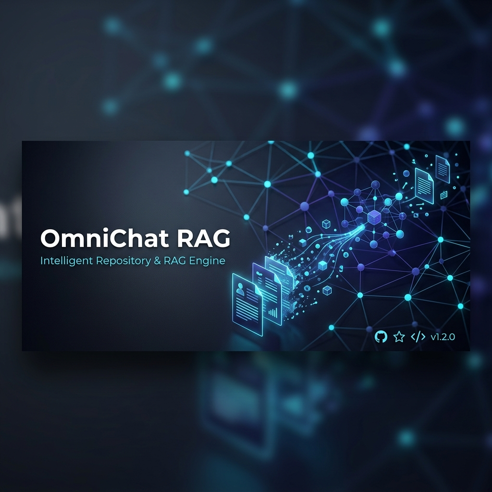
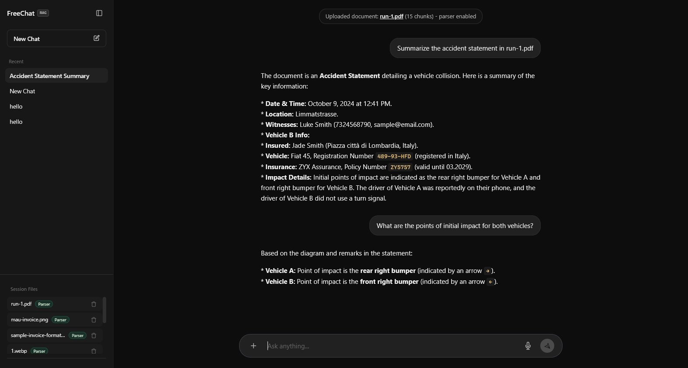
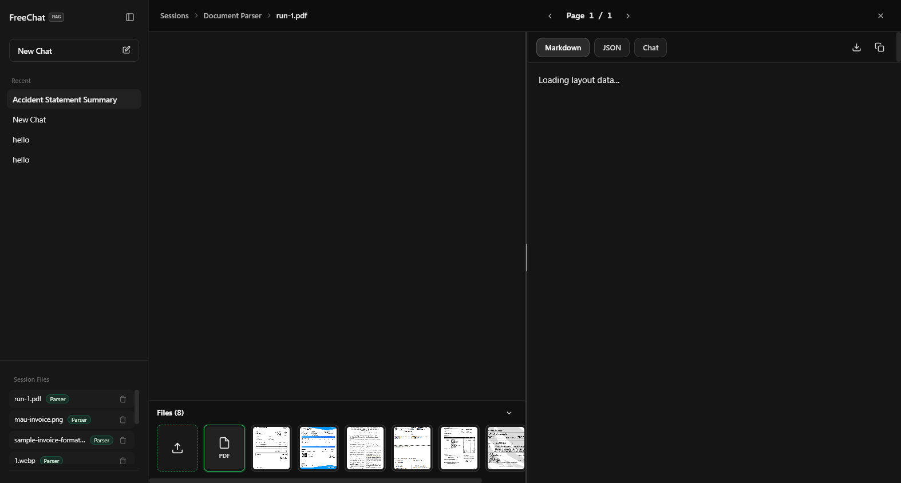
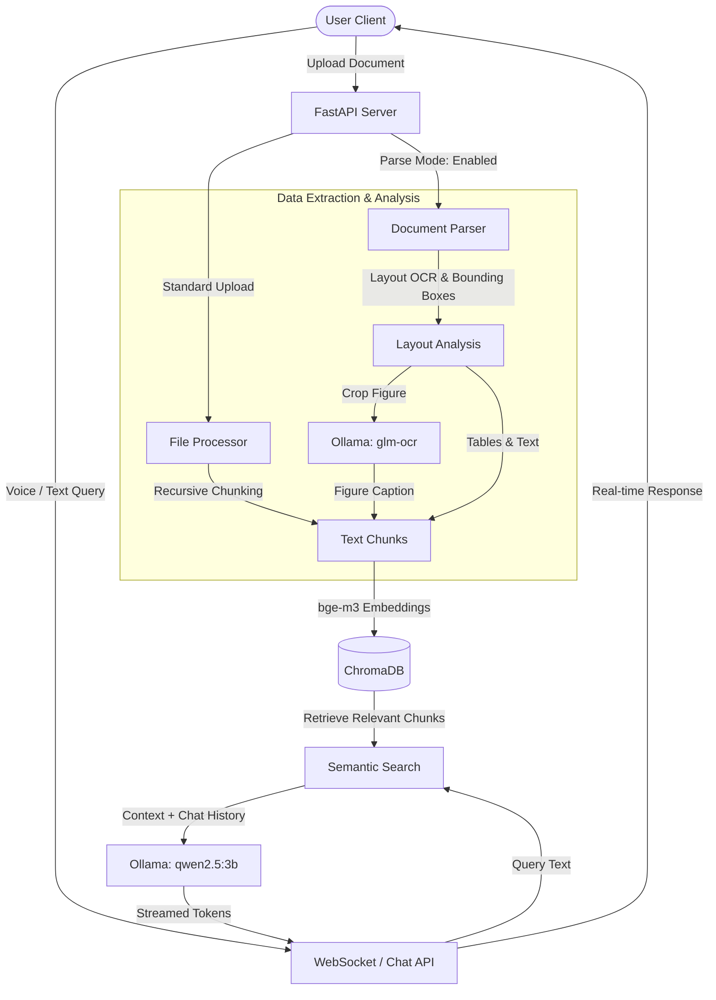

<div align="center">

# 🌟 OmniChat RAG (FreeChat Workbench)

**A Private, Offline-First Multimodal Retrieval-Augmented Generation (RAG) Workbench**

[](https://www.python.org/)
[](https://fastapi.tiangolo.com/)
[](https://ollama.com/)
[](https://www.trychroma.com/)
[](https://opensource.org/licenses/MIT)



*Experience the power of local-first RAG. Chat, transcribe voice, layout-parse documents, extract tabular data, and analyze images—all on your own machine. Zero cloud APIs, 100% privacy.*

---

[Key Features](#-key-features) • [System Architecture](#-system-architecture) • [Screenshots](#-screenshots) • [Technology Stack](#-technology-stack) • [Installation](#%EF%B8%8F-installation) • [Usage](#-usage) • [Configuration](#-configuration) • [Project Structure](#-project-structure)

</div>

## 🚀 Overview

**OmniChat RAG (FreeChat Workbench)** is a state-of-the-art, fully localized Retrieval-Augmented Generation workbench designed for security-conscious developers and teams. Operating completely offline via **Ollama**, **ChromaDB**, **Faster-Whisper**, and **PaddleOCR**, it provides a robust platform to chat with multi-format documents, transcribe voice inputs, and execute layout-aware document analysis without sending any data to external cloud services.

With its dual-pane layout, the workbench enables deep-dive visual layout analysis (OCR bounding boxes) alongside real-time markdown rendering, JSON block details, and structured document-specific Q&A.

---

## ✨ Key Features

*   💬 **Isolated Workspace Sessions:** Create and organize multiple independent chat sessions. Chat histories and vector indexes are isolated, preventing cross-document prompt pollution.
*   ⚡ **Real-Time Token Streaming:** Responsive message generation using WebSockets (WS) communication, providing instant feedback.
*   📄 **Multimodal Document Processing:** Native text extraction and chunking for `.pdf`, `.docx`, `.txt`, `.csv`, `.json`, `.xlsx`, `.md`, and `.pptx` documents.
*   🧩 **Layout-Aware PDF & Image OCR Parser:**
    *   Visual boundary box overlays highlighting headers, body text, tables, and figures.
    *   Table detection and extraction.
    *   Figure cropping with LLM-powered image captioning via Ollama (`glm-ocr`).
*   🎙️ **Voice Command & Transcription:** High-accuracy local speech-to-text transcription powered by `Faster-Whisper` (leveraging GPU acceleration if available, falling back gracefully to CPU).
*   🔍 **Advanced Semantic Search:** Hybrid retrieval blending ChromaDB semantic vector search using the `bge-m3` embedding model with contextual boundary anchors to supply full document context.
*   🔒 **100% Privacy & Local-First:** Keeps all documents, chat logs, vectors, and weights offline on your local machine.

---

## 📸 Screenshots

### 1. Main Chat Interface
A premium, dark-themed conversational workspace with custom session sidebar, drag-and-drop document uploads, voice controls, and citations.



### 2. Document Parser View
A comprehensive split-screen view showing visual bounding boxes overlaying a PDF page on the left, and parsed markdown output, JSON schemas, and specialized document-level Q&A tabs on the right.



---

## ⚙️ System Architecture

OmniChat RAG orchestrates multiple local AI models and processes files through a robust pipeline, transitioning from raw bytes to structured embeddings and semantic queries:



---

## 🛠️ Technology Stack

The workbench is built on top of high-performance libraries and localized models:

| Component | Technology / Model | Purpose |
| :--- | :--- | :--- |
| **Backend Framework** | FastAPI & Uvicorn | High-performance ASGI Web server and WebSocket endpoints |
| **RAG Orchestration** | LangChain | Prompt templates, model wrappers, and search configurations |
| **Vector Database** | ChromaDB | Local vector indexing and semantic retrieval |
| **Large Language Model**| Ollama (`qwen2.5:3b`) | Primary chat engine and text generator (customizable) |
| **Text Embedding** | Ollama (`bge-m3`) | Converts text chunks to dense vectors |
| **Image Captioning** | Ollama (`glm-ocr:latest`) | Vision model for generating descriptions for cropped figures |
| **Document OCR** | PaddleOCR & PaddlePaddle | Fast multi-language text layout analysis and table detection |
| **Voice Transcription** | Faster-Whisper (`small`) | High-speed, local automatic speech recognition |
| **Frontend UI** | HTML5, CSS3, ES6 JS | Responsive UI with tabs, PDF rendering (`pdf.js`), and drag-drop support |

---

## ⚙️ Requirements

*   **Operating System:** Windows, macOS, or Linux.
*   **Python:** Python `3.10` or later (`3.11` recommended).
*   **Ollama:** Installed and running locally.
*   **GPU (Optional but Recommended):** NVIDIA GPU with CUDA support for accelerated Faster-Whisper and PaddleOCR inference.

---

## 🛠️ Installation

### 1. Clone the Repository
```bash
git clone https://github.com/Thanhtra1702/rag-extract-document-webchat.git
cd rag-extract-document-webchat
```

### 2. Set Up Virtual Environment

**Windows PowerShell:**
```powershell
python -m venv venv
.\venv\Scripts\Activate.ps1
```

**macOS / Linux:**
```bash
python3 -m venv venv
source venv/bin/activate
```

### 3. Install Dependencies
```bash
python -m pip install --upgrade pip
pip install -r requirements.txt
```

> [!NOTE]
> On Windows, to support PDF-to-image rendering for scanned files, you may need [Poppler](https://github.com/oschwartz10612/poppler-windows) installed and added to your System PATH. If Poppler is unavailable, the application automatically falls back to `PyMuPDF`.

### 4. Fetch Ollama Models
Ensure Ollama is running, then pull the necessary models:
```bash
ollama pull qwen2.5:3b
ollama pull bge-m3
ollama pull glm-ocr:latest
```

---

## 📝 Configuration

The application works out-of-the-box using default parameters. To override settings, create a `.env` file in the project root:

```env
# URL for the Ollama service
OLLAMA_BASE_URL=http://127.0.0.1:11434

# Model used for generating captions of cropped images in layout analysis
OLLAMA_FIGURE_CAPTION_MODEL=glm-ocr:latest

# Custom PaddleOCR layout model path (Optional)
# OMNICHAT_LAYOUT_MODEL=lp://PubLayNet/faster_rcnn_R_50_FPN_3x/config
```

---

## 🏃 Usage

### Starting the Server
Run the FastAPI application from the project root:
```bash
python server.py
```
By default, the server will start on [http://localhost:8000](http://localhost:8000) with auto-reload enabled.

### Operational Guide
1.  **Create a Session:** Click **+ New Chat** in the left sidebar.
2.  **Upload Documents (Standard RAG):** Click the **+** button in the chat input bar, select **Upload documents**, and choose files. Ask questions in the chat interface.
3.  **Visual Layout Parsing:** Click the **+** button, select **Parse document**. The UI will open the split-screen **Document Parser View**. Here you can inspect detected segments, download the structured Markdown or raw JSON output, and chat with the isolated document context.
4.  **Voice Interaction:** Click the Microphone button, record your prompt, and send. It will automatically convert speech to text and submit.

---

## 📁 Project Structure

```text
.
├── assets/                 # Generated screenshots and logo assets
│   ├── banner.png          # Repository branding banner
│   ├── chat_view.png       # Screenshot of the main Chat UI
│   └── parser_view.png     # Screenshot of the split-pane parser UI
├── chat_sessions/          # [Local] Persistent session JSON stores
├── db/                     # [Local] Vector database directory (ChromaDB)
├── static/                 # Frontend assets (HTML, CSS, JS)
│   ├── index.html          # Main SPA interface
│   ├── style.css           # Custom styles (theme, widgets)
│   └── app.js              # Client logic and WebSocket streaming
├── tools/                  # [Local] PaddleOCR home cache directories
├── uploaded_files/         # [Local] Target folder for uploaded documents
│   └── _layout_cache/      # [Local] Cached layouts and cropped figures
├── config.py               # Application configurations and model definitions
├── document_parser.py      # Layout analysis, PaddleOCR parsing & figure captioning
├── file_processor.py       # Standard document processors (PDF, docx, csv, etc.)
├── rag_engine.py           # RAG Core: embeddings, retrievals, LLM queries, and whisper
├── requirements.txt        # Third-party package dependencies
├── server.py               # FastAPI router endpoints & WebSocket server
└── README.md               # Repository documentation
```

---

## 🤝 Contributing

Contributions are welcome! Please feel free to open Issues or submit Pull Requests to enhance the capabilities of this workbench.

## 📄 License

This project is licensed under the MIT License.
